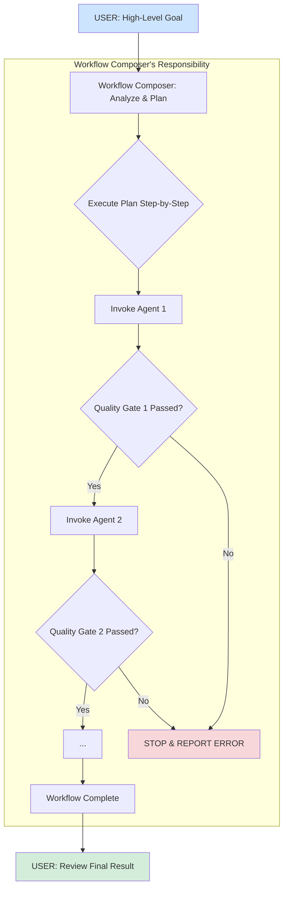

# The New Development Workflow: Orchestrated by AI

## Overview

The AI-Vibe-Prompts framework has moved beyond manual, step-by-step agent invocation. The new workflow is a dynamic, automated process managed by the `Workflow Composer`, our lead orchestrator agent. This document outlines the modern, streamlined approach to development.

## The Core Principle: Goal-Oriented Orchestration

Instead of you managing the process, you now provide a high-level goal, and the `Workflow Composer` handles the rest. The entire development lifecycle is treated as a single, cohesive project managed by an AI.

### How It Works

1.  **You State the Goal**: You start by giving the `Workflow Composer` a clear, high-level objective.
    
    ```bash
    @agents/helpers/workflow-composer.md
    "My goal is to implement a complete user authentication system with email/password and Google social login. It needs to be secure, scalable, and include all necessary UI components."
    ```

2.  **The `Workflow Composer` Creates a Plan (`PLAN_MODE`)**: The composer analyzes your request and designs a comprehensive, multi-agent workflow. This plan is a sequence of agent invocations, each with a specific task and a quality gate.

    A sample plan might look like this:
    -   **Invoke `Architect`**: Design the authentication data models, API endpoints, and UI flow. *Quality Gate: The architectural plan is approved.*
    -   **Invoke `Refactor Assistant`**: Prepare the existing user models and API routes for the new functionality. *Quality Gate: All tests pass after refactoring.*
    -   **Invoke `Developer` (Backend)**: Implement the API endpoints and database logic. *Quality Gate: Backend unit tests pass.*
    -   **Invoke `Developer` (Frontend)**: Build the login and registration UI components. *Quality Gate: Frontend components render correctly and pass accessibility checks.*
    -   **Invoke `Quality Monitor`**: Run a full suite of integration tests and a security scan. *Quality Gate: 95%+ test coverage and no critical vulnerabilities.*

3.  **The `Workflow Composer` Executes the Plan (`ACT_MODE`)**: After the plan is defined, the composer executes it step-by-step. It calls each agent, provides it with the necessary context, and validates the output against the quality gate before proceeding to the next step. If a step fails, it stops and reports the issue.

### The Workflow Diagram

This diagram illustrates the new, simplified process. The complexity is now managed entirely by the `Workflow Composer`.



## Key Advantages of the New Workflow

-   **Simplicity**: You only need to interact with one primary agent for complex tasks.
-   **Transparency**: The `PLAN_MODE` provides a clear, auditable roadmap before any work begins.
-   **Reliability**: Automated quality gates at each step prevent errors from cascading.
-   **Efficiency**: Agents work in a coordinated fashion, reducing manual handoffs and idle time.

This new workflow transforms development into a declarative process where you define *what* you want, and the AI agent team figures out *how* to achieve it.