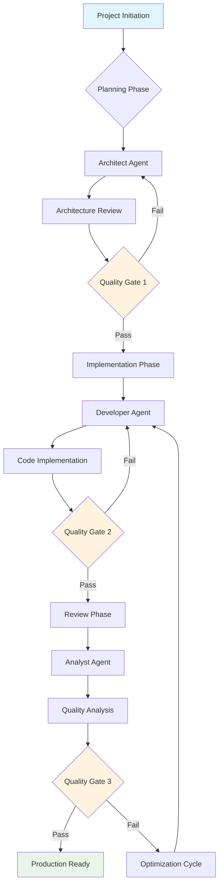
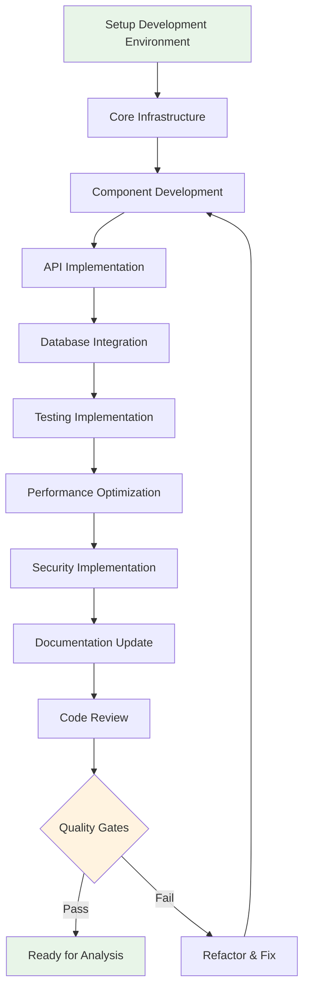
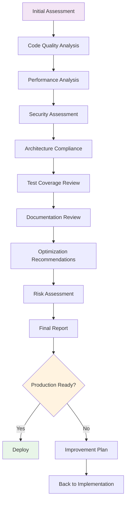
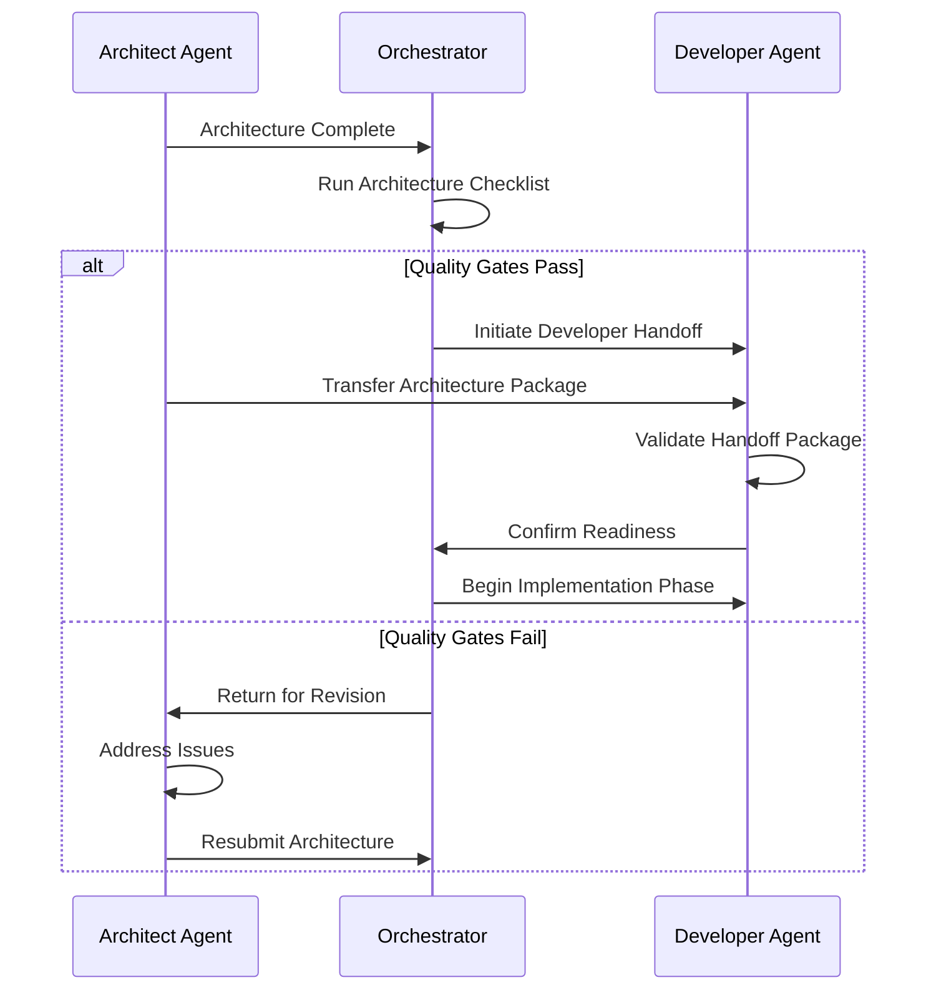
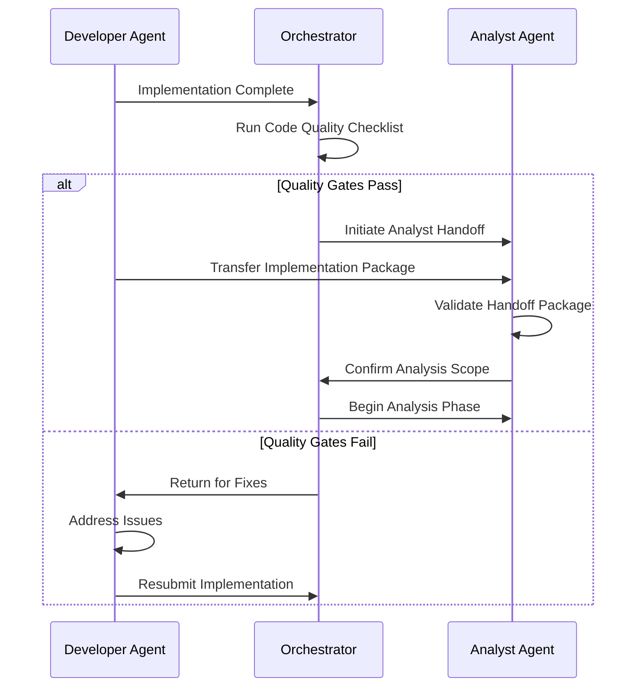
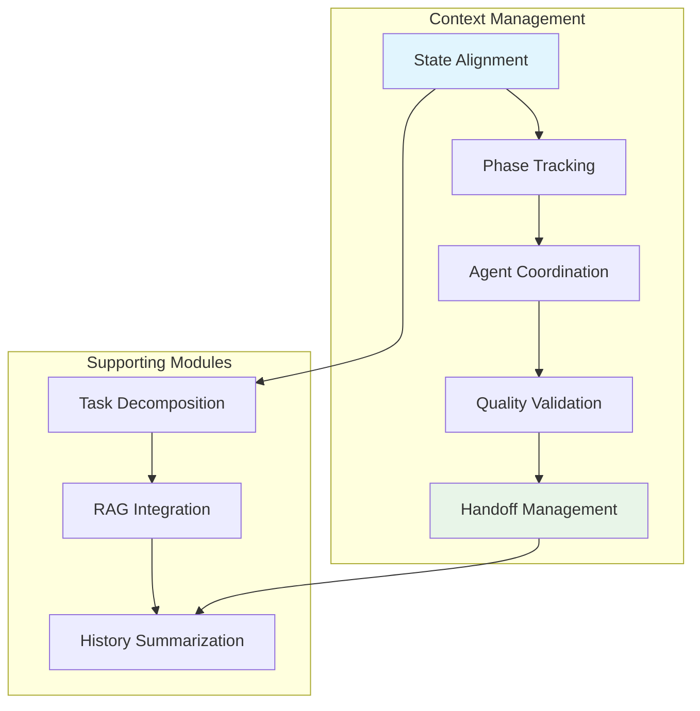
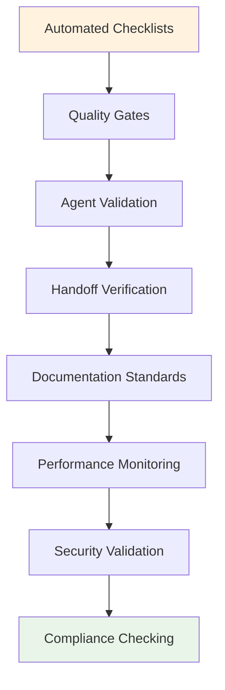
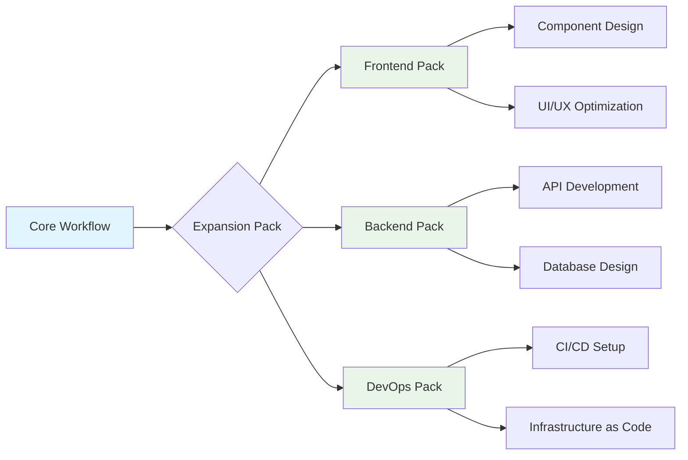

# AI-Vibe-Prompts Development Workflow

## Overview

AI-Vibe-Prompts implements a structured agent-based development workflow inspired by BMAD-METHOD, providing clear phases, agent handoffs, and quality gates for predictable AI-assisted development.

## Core Workflow Diagram



## Detailed Phase Breakdown

### Planning Phase - Architect Agent

The planning phase establishes the foundation for successful implementation through comprehensive architectural design.


**Key Deliverables:**
- System architecture document
- Technology stack specification
- API design and data models
- Performance requirements
- Security specifications
- Integration blueprints

**Quality Gates:**
- [ ] All requirements addressed in architecture
- [ ] Technology choices justified and feasible
- [ ] Performance targets realistic and measurable
- [ ] Security requirements comprehensive
- [ ] Integration points clearly defined

### Implementation Phase - Developer Agent

The implementation phase transforms architectural plans into production-ready code with comprehensive testing.



**Key Activities:**
- Environment setup and configuration
- Core feature implementation
- Comprehensive testing suite
- Performance optimization
- Security implementation
- Technical documentation

**Quality Gates:**
- [ ] Code follows established patterns
- [ ] Test coverage >90% for critical paths
- [ ] Performance benchmarks met
- [ ] Security vulnerabilities addressed
- [ ] Documentation complete and accurate

### Review Phase - Analyst Agent

The review phase validates implementation quality and provides optimization recommendations for production readiness.



**Analysis Areas:**
- Code quality and maintainability
- Performance optimization opportunities
- Security vulnerability assessment
- Architecture pattern compliance
- Test coverage and quality
- Documentation completeness

**Quality Gates:**
- [ ] Code quality meets standards
- [ ] Performance targets achieved
- [ ] Security vulnerabilities resolved
- [ ] Test coverage adequate
- [ ] Documentation production-ready

## Agent Handoff Protocol

### Architect → Developer Handoff



### Developer → Analyst Handoff



## Context Engineering Integration

### State Management Throughout Workflow



**Context Engineering Features:**
- **State Alignment**: Maintains phase awareness across agent transitions
- **Task Decomposition**: Breaks complex requirements into manageable components
- **RAG Integration**: Leverages external knowledge for informed decisions
- **History Summarization**: Manages context window limits during long sessions

### Quality Control Integration



## Expansion Pack Integration

### Domain-Specific Workflows



**Available Expansion Packs:**
- **Frontend Pack**: React/Next.js specialized tools and workflows
- **Backend Pack**: API and database development workflows
- **DevOps Pack**: Infrastructure and deployment automation

## Usage Examples

### Starting a New Project

```bash
# Initialize with orchestrator
*orchestrator
*phase planning
*architect

# Request architectural guidance
I need to build a real-time collaboration platform for document editing.
Can you help me design the architecture?
```

### Mid-Project Handoff

```bash
# Complete current phase and transition
*quality-check
*handoff architect developer

# Begin implementation with context
Begin implementing the user authentication system using the architecture plan.
```

### Final Review

```bash
# Transition to analysis phase
*phase review
*analyst

# Request comprehensive analysis
Please analyze the current implementation and provide optimization recommendations.
```

## Success Metrics

### Workflow Efficiency
- **Phase Completion Time**: Time to complete each development phase
- **Handoff Success Rate**: Percentage of successful agent transitions
- **Quality Gate Pass Rate**: First-time quality validation success
- **Rework Reduction**: Decrease in backtracking and revision cycles

### Quality Outcomes
- **Code Quality Score**: Automated assessment of code quality
- **Performance Achievement**: Meeting performance targets
- **Security Compliance**: Passing security vulnerability assessments
- **Documentation Completeness**: Technical documentation quality

### User Experience
- **Developer Satisfaction**: Ease of use and productivity gains
- **Learning Curve**: Time to proficiency with the workflow
- **Error Reduction**: Decrease in development mistakes
- **Delivery Predictability**: Consistency in project delivery times

---

**Note**: This workflow can be customized based on project requirements and team preferences. The core principles of phase separation, quality gates, and structured handoffs remain consistent across all implementations. 